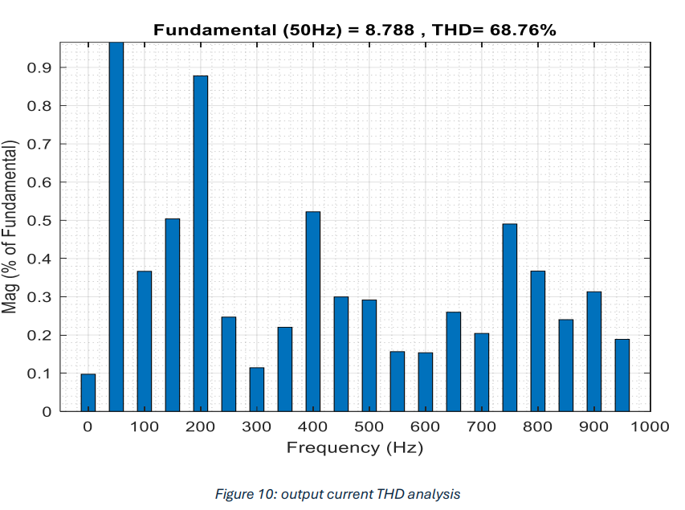
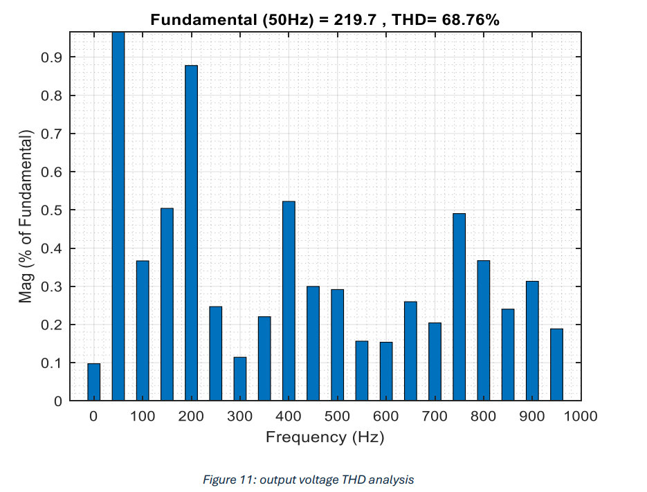
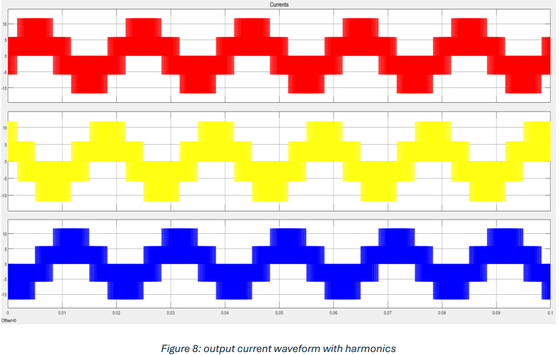
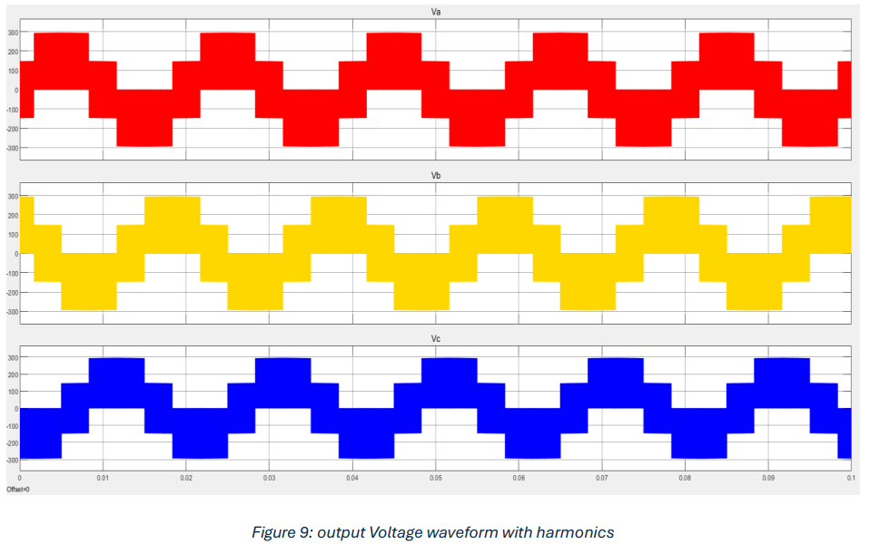
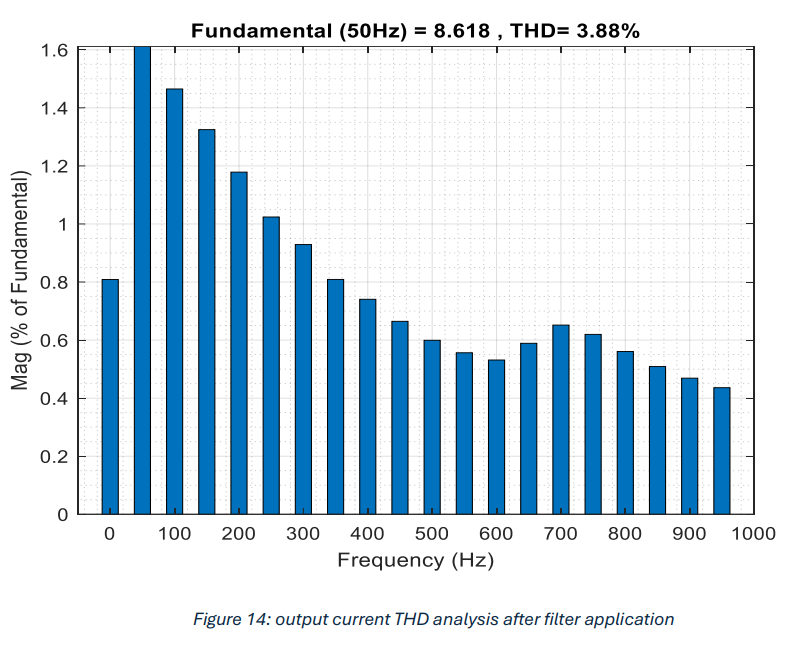
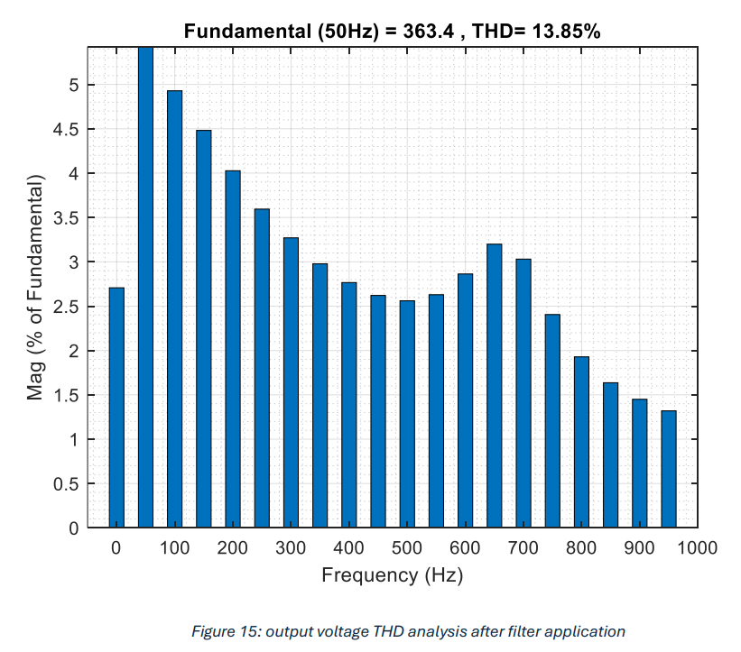

# SPWM-Based Three-Phase Inverter for Renewable Energy Systems

  

This repository contains two projects focused on power electronics and renewable energy systems. The primary project involves the design and implementation of a **three-phase inverter using Sinusoidal Pulse Width Modulation (SPWM)** to minimize Total Harmonic Distortion (THD) for grid integration of renewable energy sources. The second project (placeholder) will be added later.

---

## Project Overview
This project aims to develop a three-phase voltage source inverter (VSI) using SPWM techniques to reduce harmonic distortion. The system is simulated in MATLAB Simulink and validated with hardware implementation using a Texas Instruments TMS320F28379D DSP. An LC filter is designed to further suppress high-order harmonics.

### Key Features:
- **SPWM signal generation** with 10 kHz carrier frequency.
- **THD reduction** from **68.76% to 3.88%** (current) and **13.85%** (voltage).
- **MATLAB Simulink simulation** with FFT-based harmonic analysis.
- **Lab implementation** using IGBTs, DSP, and LC filters.

---

## Simulation Results

### 1. Output Waveforms Without Filter
| **Current THD (68.76%)** | **Voltage THD (68.76%)** |
|------------------------------------------|--------------------------|
| |  |
|  |  |

### 2. Output Waveforms After LC Filter Application
| **Current THD (3.88%)** | **Voltage THD (13.85%)** |
|-------------------------|--------------------------|
|  |  |

### 3. SPWM Signals and Hardware Setup
| **PWM Signals for IGBT Gates** | **Lab Setup** |
|--------------------------------|---------------|
|  |  |
